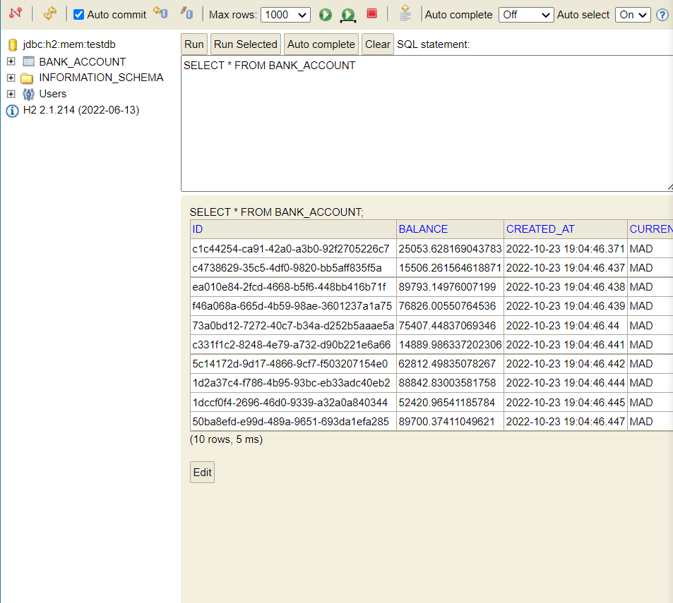
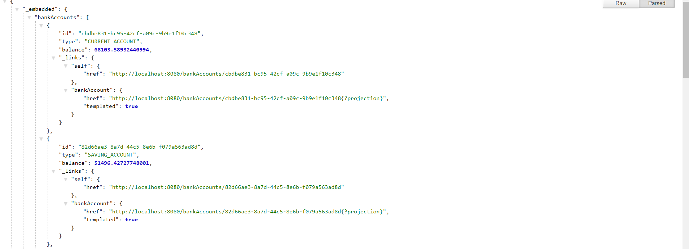
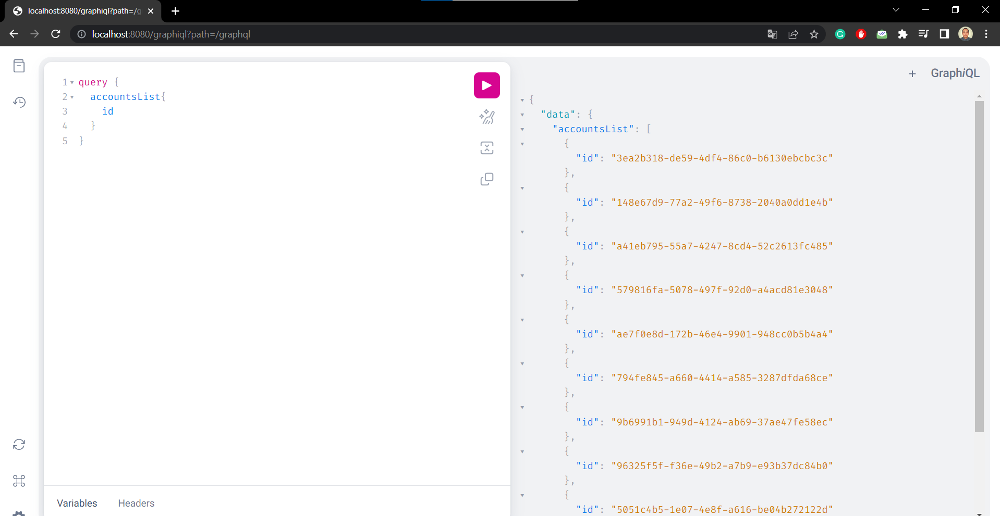
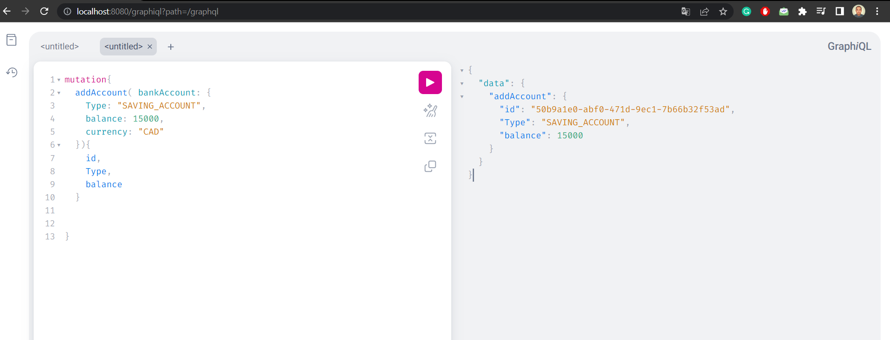
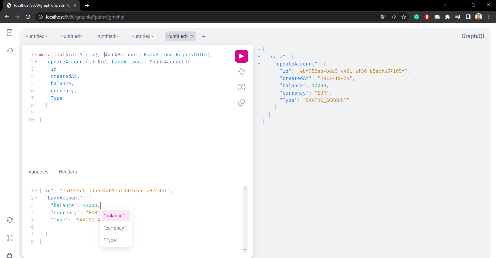
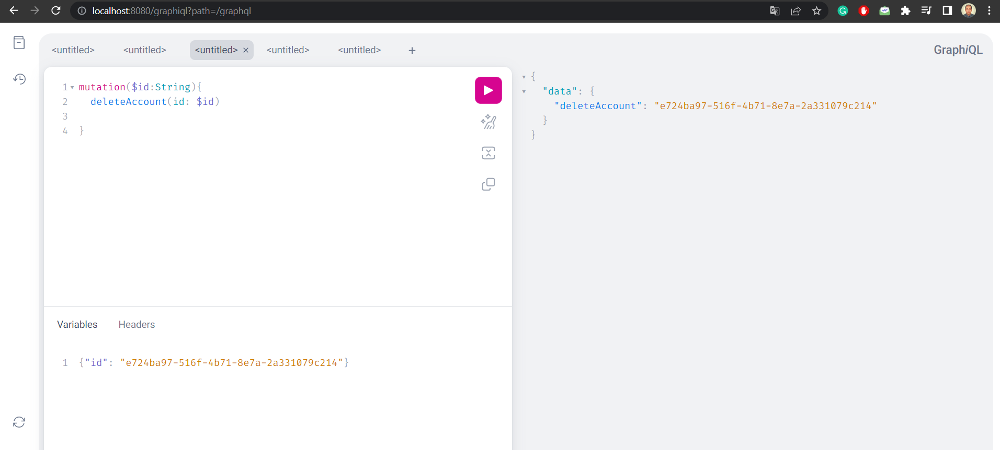

# Premier-Micro-service - Yassine Lambarki

Travail à faire :
- [x] Créer un projet Spring Boot avec les dépendances Web, Spring Data JPA, H2, Lombok
- [x] Créer l'entité JPA Compte
- [x] Créer l'interface CompteRepository basée sur Spring Data
- [x] Tester la couche DAO
- [x] Créer le Web service Restfull qui permet de gérer des comptes
- [x] Tester le web micro-service en utilisant un client REST comme Postman
- [x] Générer et tester le documentation Swagger de des API Rest du Web service
- [x] Exposer une API Restful en utilisant Spring Data Rest en exploitant des projections
- [x] Créer les DTOs et Mappers
- [x] Créer la couche Service (métier) et du micro service

### images
````
http://localhost:8080/h2
````



````
http://localhost:8080/bankAccounts
````


````
http://localhost:8080/bankAccounts/fc11d3dc-9560-40be-816f-e53f6ac715a7
````


### Swagger

````
http://localhost:8080/swagger-ui/index.html
````


### Swagger /v3/api-docs

````
http://localhost:8080/v3/api-docs
````


### RepositoryRestResource

````
http://localhost:8080/bankAccounts/search/findByType?type=SAVING_ACCOUNT
http://localhost:8080/bankAccounts/search/findByType?type=CURRENT_ACCOUNT
````

### Projection interface spring data rest

````
http://localhost:8080/bankAccounts?projection=p1
````




### Restresource

````
http://localhost:8080/bankAccounts/search/byType?t=SAVING_ACCOUNT
````


### GraphQL

````
http://localhost:8080/graphiql?path=/graphql
````




### Fixing the date issue with GraphQL

[library](https://github.com/graphql-java/graphql-java-extended-scalars)

##### 1st step
````
<dependency>
  <groupId>com.graphql-java</groupId>
  <artifactId>graphql-java-extended-scalars</artifactId>
  <version>17.0</version>
</dependency>
````

##### 2nd step

````````
@Configuration
public class GraphQlConfig {
    @Bean
    public RuntimeWiringConfigurer runtimeWiringConfigurer() {
        return wiringBuilder -> wiringBuilder.scalar(ExtendedScalars.DateTime);
    }
}
````````

##### 3rd step
And use the scalar in your schema


````````
scalar DateTime
type Something {
    someDateTime: DateTime
}
````````


And the result 🎉🎉✨👍


#### DataFetcherExceptionResolverAdapter

- create a custom exception handler
- capture the error in case the id not found
- show the correct message 

example


#### Mutation

1st Method



2nd Method


#### Mutation (Save) ✅




#### Mutation (delete) ❌




